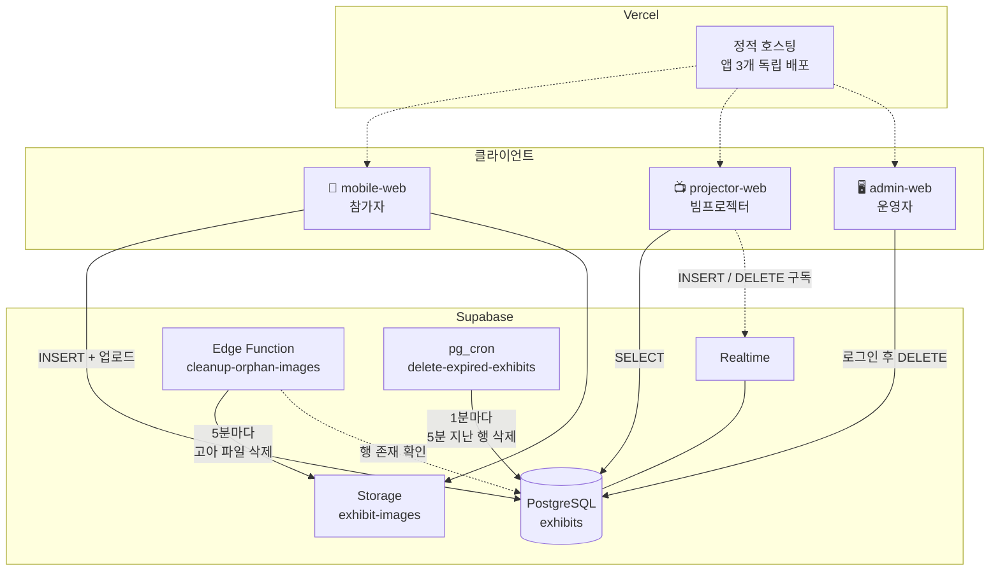
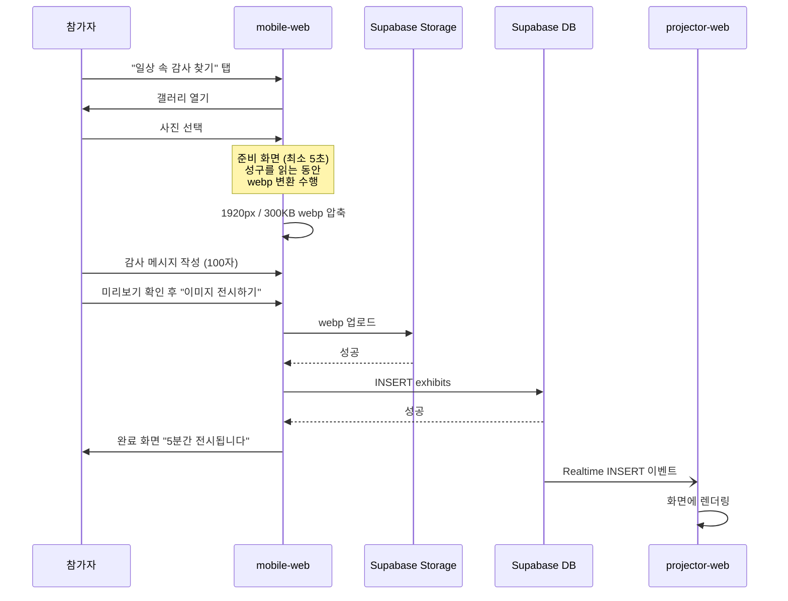
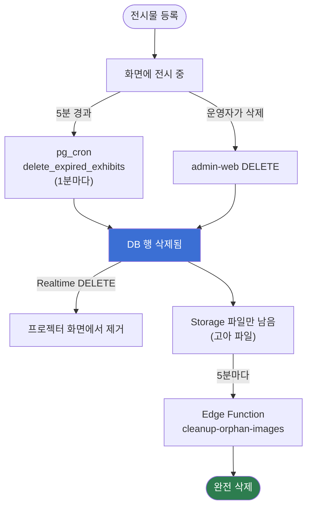
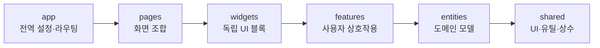
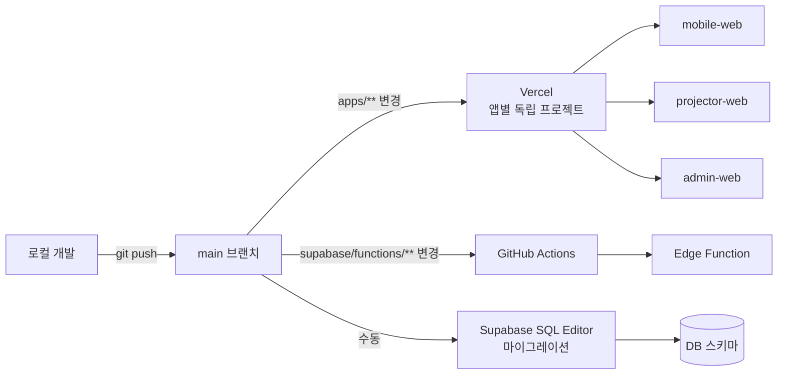

# glimpse of epiphany

> 삶으로 쓰는 예배전(展) — 일상 속 감사 찾기

수련회 참가자가 자기 폰으로 사진 한 장과 감사의 문장을 올리면,
그것이 실시간으로 빔프로젝터 화면에 떠오르는 웹 애플리케이션입니다.

올라온 사진은 **5분 동안만 전시되고 흔적 없이 사라집니다.**
붙잡아 두지 않는 것이 이 프로젝트의 이름이자 설계 원칙입니다.

---

## 목차

- [무엇을 만들었나](#무엇을-만들었나)
- [시스템 아키텍처](#시스템-아키텍처)
- [사진 한 장이 화면에 뜨기까지](#사진-한-장이-화면에-뜨기까지)
- [사진이 사라지기까지](#사진이-사라지기까지)
- [애플리케이션 아키텍처](#애플리케이션-아키텍처)
- [데이터베이스](#데이터베이스)
- [이미지 관리](#이미지-관리)
- [개발 환경 설정](#개발-환경-설정)
- [형상 관리](#형상-관리)
- [빌드 및 배포](#빌드-및-배포)
- [문서 지도](#문서-지도)

---

## 무엇을 만들었나

### 해결하려던 문제

150명이 모인 수련회에서, 참가자 각자가 발견한 일상의 감사를 **한 화면에 모아 보여주고 싶었습니다.**
카카오톡으로 사진을 받아 운영자가 하나씩 띄우는 방식은 사람이 계속 붙어 있어야 하고, 흐름이 끊깁니다.

### 제약 조건

| 제약 | 선택 |
| --- | --- |
| 예산이 없다 | 서버를 두지 않고 Supabase 무료 티어 안에서 해결 |
| 참가자에게 앱 설치를 시킬 수 없다 | 링크만 열면 되는 모바일 웹 |
| 150명이 동시에 몰린다 | 클라이언트에서 이미지를 300KB로 압축해 올림 |
| 부적절한 사진이 올라올 수 있다 | 운영자 전용 앱에서 즉시 삭제 |
| 개인 사진이 서버에 남으면 안 된다 | 5분 뒤 DB와 CDN 양쪽에서 하드 삭제 |

### 세 개의 앱

| 앱 | 사용자 | 하는 일 |
| --- | --- | --- |
| [`apps/mobile-web`](apps/mobile-web) | 참가자 (150명) | 사진 선택 → 감사 작성 → 전시 |
| [`apps/projector-web`](apps/projector-web) | 빔프로젝터 (1대) | 올라온 사진을 실시간으로 렌더링 |
| [`apps/admin-web`](apps/admin-web) | 운영자 | 전시 중인 사진 확인 및 삭제 |

> `projector-web`은 아직 구현 전입니다. 나머지 두 앱과 공유 패키지는 완성되어 있습니다.

---

## 시스템 아키텍처

**백엔드 서버가 없습니다.** 세 앱이 Supabase와 직접 통신하고, 접근 통제는 전부 RLS(Row Level Security) 정책이 담당합니다.



### 왜 백엔드가 없는가

무과금이 첫 번째 이유지만, 그것만은 아닙니다. 이 앱이 하는 일은 **한 테이블에 INSERT하고, 구독하고, DELETE하는 것**이 전부입니다. 그 사이에 서버를 한 겹 두면 배포 대상과 장애 지점만 늘어납니다.

대신 **보안이 전적으로 RLS에 달리게** 됩니다. `anon` 키는 브라우저 번들에 그대로 노출되므로 비밀이 아니고, 실제로 막아주는 것은 정책뿐입니다. 자세한 내용은 [supabase/README.md](supabase/README.md#보안)에 있습니다.

---

## 사진 한 장이 화면에 뜨기까지



**압축을 준비 화면에서 하는 이유**가 있습니다. 원래 이 5초는 성구를 읽는 시간이었는데, 화면에는 스피너가 도는데 실제로는 아무 일도 하지 않았습니다. 어차피 기다리는 시간이라면 그동안 무거운 작업을 끝내두는 편이 정직하고, 제출 버튼을 누른 뒤에는 네트워크 업로드만 남아 체감이 빨라집니다.

**업로드까지 당기지는 않았습니다.** 압축은 폰 안에서 끝나지만 업로드는 서버에 흔적을 남깁니다. 참가자가 아직 "전시하기"에 동의하지 않은 시점이고, 중간에 그만두는 사람마다 고아 파일이 쌓입니다.

---

## 사진이 사라지기까지

**DB의 행이 단일 진실 공급원이고, CDN 파일이 그 뒤를 따라옵니다.**



### 왜 두 갈래로 나눴나

행 삭제는 **순수 SQL 크론**이, 파일 삭제는 **Edge Function**이 맡습니다. 하나로 합치지 않은 이유는 실패 양상 때문입니다.

Edge Function이 배포되지 않았거나 죽어 있어도, 행 삭제는 DB 안에서 돌기 때문에 **"5분간만 전시된다"는 참가자와의 약속은 지켜집니다.** 함수가 멈추면 눈에 보이지 않는 파일 정리만 밀립니다. 반대로 했다면 함수 장애가 곧 개인 사진 노출로 이어졌을 겁니다.

Storage 파일을 SQL로 지울 수 없다는 제약도 있습니다. `storage.objects`에서 행을 지워도 실제 파일은 남기 때문에, Storage API를 호출할 수 있는 Edge Function이 필요합니다.

---

## 애플리케이션 아키텍처

### 모노레포 구조

```
glimpse-of-epiphany/
├── apps/
│   ├── mobile-web/       참가자용 SPA (TanStack Router)
│   ├── projector-web/    빔프로젝터용 SPA (GSAP)
│   └── admin-web/        운영자용 SPA (라우터 없음)
├── packages/
│   ├── api/              Supabase 클라이언트 및 도메인 API
│   ├── env/              환경변수 읽기·검증
│   ├── utils/            순수 유틸 함수
│   └── config/           ESLint / TSConfig 공유 설정
├── supabase/
│   ├── migrations/       DB 스키마 (형상 관리 대상)
│   └── functions/        Edge Function
└── .github/workflows/    Edge Function 자동 배포
```

세 앱의 UI 성격이 완전히 달라 **공용 UI 패키지를 두지 않았습니다.** 참가자용은 감성적인 글래스 UI, 운영자용은 정보 밀도가 높은 다크 대시보드입니다. 억지로 공통화하면 양쪽 다 어색해집니다. 각 앱의 `shared/ui`에서 따로 관리합니다.

### FSD (Feature-Sliced Design)

앱 내부는 단방향 의존성을 강제하는 FSD를 따릅니다. 상위 레이어는 하위를 import할 수 있지만 반대는 불가능합니다.



같은 레이어 안의 다른 슬라이스끼리도 직접 import할 수 없고, 각 슬라이스는 `index.ts`로 공개 API를 노출합니다.

### 기술 선택

| 영역 | 선택 | 이유 |
| --- | --- | --- |
| 빌드 | Vite + Turborepo | 앱 3개를 독립 배포하면서 설정은 공유 |
| 언어 | TypeScript | DB 스키마에서 타입을 생성해 끝까지 연결 |
| 스타일 | CSS Modules | Tailwind 미사용. 스코프 격리 + 디자인 토큰 |
| 라우팅 | TanStack Router | 파일 기반 + search param 타입 안전성 |
| 애니메이션 | GSAP | 프로젝터의 연속 렌더링에 적합 |
| 백엔드 | Supabase | Auth·DB·Storage·Realtime을 한 번에 |

---

## 데이터베이스

테이블 하나와 버킷 하나가 전부입니다.

### `public.exhibits`

| 컬럼 | 타입 | 설명 |
| --- | --- | --- |
| `id` | `uuid` | 기본키. Realtime DELETE 이벤트가 이 값만 싣고 온다 |
| `image_path` | `text` `unique` | Storage 내부 경로 (`<uuid>.webp`). 공개 URL은 클라이언트가 조합 |
| `message` | `text` | 감사 메시지. 입력 UI 100자, DB 제약 200자 |
| `client_id` | `uuid` `null` | 업로드한 기기 식별자. 반복 업로더를 기기 단위로 정리하기 위한 값 |
| `created_at` | `timestamptz` | 만료 판단 기준 |

`client_id`를 **nullable로 둔 것은 의도적입니다.** 값이 없다고 업로드가 실패하면 안 됩니다. 참가자가 사진을 올리는 것이 이 앱의 전부이고, 이 값은 운영 편의를 위한 부가 정보입니다.

### 접근 권한 (RLS)

| 동작 | anon (참가자·프로젝터) | authenticated (운영자) |
| --- | --- | --- |
| 읽기 | ✅ | ✅ |
| 생성 | ✅ | ✅ |
| 수정 | ❌ | ❌ |
| 삭제 | ❌ | ✅ |

anon에게 삭제를 열면 URL을 아는 참가자 누구나 전체 전시물을 지울 수 있습니다. Storage 삭제는 **아무에게도** 열지 않았고, Edge Function이 RLS를 우회하는 `service_role`로 처리합니다.

### 스키마 변경 규칙

DDL은 **`supabase/migrations/*.sql`에만** 작성합니다. 대시보드나 MCP로 직접 적용하면 레포와 실제 DB가 어긋납니다. 한 번 적용한 마이그레이션은 수정하지 않고 새 파일을 추가합니다.

변경 후에는 타입을 재생성합니다.

```bash
SUPABASE_PROJECT_ID=<project-ref> pnpm gen:db-types
```

`packages/api/src/database.types.ts`는 생성물이라 직접 수정하지 않습니다. 파생 타입이 필요하면 `packages/api/src/types.ts`에 작성합니다.

---

## 이미지 관리

### 압축

폰 카메라 사진은 3~10MB입니다. 150명이 그대로 올리면 무료 티어 대역폭이 남지 않고, 업로드도 느립니다.

| 항목 | 값 | 근거 |
| --- | --- | --- |
| 포맷 | webp | 같은 화질에서 JPEG보다 작음 |
| 최대 크기 | 300KB | 150장 올려도 45MB |
| 최대 해상도 | 긴 변 1920px | FHD 빔프로젝터를 꽉 채워도 충분 |
| 실행 위치 | web worker | 메인 스레드를 막지 않음 |

`browser-image-compression`으로 [준비 화면](apps/mobile-web/README.md)에서 변환합니다.

### 저장과 서빙

공개 버킷에 저장하고 CDN 공개 URL로 바로 서빙합니다. 프로젝터가 빠르게 로드해야 하므로 서명 URL을 쓰지 않습니다. 버킷 자체에 **webp만 허용, 파일당 1MB 제한**을 걸어 클라이언트 압축이 실패해도 서버에서 한 번 더 걸러집니다.

**캐시 수명은 5분입니다.** 전시 시간과 같게 맞췄습니다. 길게 잡으면 삭제한 뒤에도 CDN 엣지에서 계속 서빙되어 하드 삭제가 성립하지 않습니다.

### 삭제

위 [사진이 사라지기까지](#사진이-사라지기까지)를 참고하세요. 소프트 삭제 플래그를 두지 않고 **행과 파일을 실제로 지웁니다.**

---

## 개발 환경 설정

### 요구 사항

| 도구 | 버전 |
| --- | --- |
| Node.js | 20 이상 |
| pnpm | 10 이상 (`corepack enable`) |

### 1. 설치

```bash
git clone https://github.com/kingkiboots/glimpse-of-epiphany.git
cd glimpse-of-epiphany
pnpm install
```

### 2. 환경변수

세 앱이 같은 Supabase 프로젝트를 바라보므로 **`.env`는 레포 루트에 한 벌만** 둡니다.
각 앱의 `vite.config.ts`가 `envDir`을 루트로 지정하고 있습니다.

```bash
cp .env.example .env
```

Supabase 대시보드 > Project Settings > Data API에서 값을 복사해 채웁니다.
Supabase 프로젝트를 새로 만드는 경우 [supabase/README.md](supabase/README.md#처음-세팅하기)의 순서를 따르세요.

> ⚠️ `VITE_` 접두사가 붙은 값은 빌드 시 번들에 그대로 노출됩니다.
> `service_role` 키와 Personal Access Token에는 어떤 이유로도 이 접두사를 붙이지 마세요.
> 실수를 막기 위해 `packages/env`가 실행 시점에 키 종류를 검사하고 예외를 던집니다.

### 3. 개발 서버 실행

```bash
pnpm dev                              # 모든 앱 동시 실행
pnpm --filter mobile-web dev          # 특정 앱만
pnpm --filter mobile-web dev:host     # 같은 와이파이의 실제 폰에서 접속
pnpm --filter admin-web dev
```

**모바일 웹은 실제 폰에서 확인하세요.** 갤러리 열기, 터치 영역, 안전 영역 처리는 데스크톱 브라우저에서 재현되지 않습니다. `dev:host`로 띄우면 터미널에 Network 주소가 뜹니다.

### 4. 그 외 명령

```bash
pnpm build          # 전체 타입 검사 + 프로덕션 빌드
pnpm lint           # ESLint
pnpm storybook      # 컴포넌트 카탈로그 (mobile-web)
pnpm gen:db-types   # DB 스키마에서 타입 재생성
```

### 의존성 추가

```bash
pnpm add <package> --filter mobile-web
pnpm add -D <package> --filter @packages/api
```

---

## 형상 관리

### 브랜치

`main`이 배포 기준입니다. 기능 단위로 브랜치를 파고 머지합니다.

### 커밋

Conventional Commits를 따릅니다. **본문에는 무엇을 했는지보다 왜 그렇게 했는지를 남깁니다.**
코드만 봐서는 알 수 없는 판단(왜 그 순서인지, 왜 그 방법을 쓰지 않았는지)이 남을 자리입니다.

```
feat(mobile): 사진 선택을 홈으로 옮기고 준비 화면에서 webp 변환

갤러리는 홈 버튼의 onClick에서 곧바로 연다. 화면을 먼저 옮긴 뒤 코드로 열면
모바일 브라우저가 사용자 제스처 없는 파일 선택으로 보고 막는다.
```

| 타입 | 용도 |
| --- | --- |
| `feat` | 기능 추가 |
| `fix` | 버그 수정 |
| `refactor` | 동작 변화 없는 구조 개선 |
| `perf` | 성능 개선 |
| `docs` | 문서 |
| `chore` / `ci` | 설정·빌드·워크플로 |

### 커밋에 포함되면 안 되는 것

- `.env` (`.gitignore`로 차단)
- `service_role` 키, Personal Access Token
- `packages/api/src/database.types.ts`의 수작업 수정 (생성물)

---

## 빌드 및 배포



### 프론트엔드 (Vercel)

앱마다 **독립된 Vercel 프로젝트**를 만들고 Root Directory를 각 앱 경로로 지정합니다.

| 항목 | 값 |
| --- | --- |
| Root Directory | `apps/mobile-web` |
| Framework Preset | Vite |
| 환경변수 | `VITE_SUPABASE_URL`, `VITE_SUPABASE_ANON_KEY` |

주의할 점이 두 가지 있습니다.

**`VITE_` 값은 빌드 시점에 번들에 박힙니다.** 대시보드에서 환경변수만 고치면 이미 배포된 빌드는 그대로입니다. 반드시 재배포해야 반영됩니다.

**Root Directory 밖의 변경은 배포를 건너뜁니다.** `supabase/`만 고친 커밋은 프론트를 다시 빌드하지 않습니다. 의도된 동작이며, 강제로 돌리려면 Settings > Git > Deploy Hooks를 쓰세요.

`mobile-web`은 클라이언트 라우팅을 쓰므로 [`vercel.json`](apps/mobile-web/vercel.json)에 SPA rewrite가 필요합니다. 없으면 `/compose`에서 새로고침할 때 404가 납니다.

### Edge Function (GitHub Actions)

`supabase/functions/**`가 `main`에 올라가면 [워크플로](.github/workflows/deploy-edge-functions.yml)가 자동 배포합니다. 로컬에 CLI를 설치하거나 대시보드에서 직접 편집할 필요가 없고, **레포의 코드와 실제 배포본이 어긋나지 않습니다.**

저장소 시크릿 두 개가 필요합니다 (Settings > Secrets and variables > Actions > **Repository secrets**).

| 이름 | 값 |
| --- | --- |
| `SUPABASE_ACCESS_TOKEN` | Supabase 개인 액세스 토큰 |
| `SUPABASE_PROJECT_ID` | 프로젝트 참조 문자열 |

### 데이터베이스

마이그레이션은 자동화하지 않았습니다. SQL Editor에 순서대로 붙여넣어 적용합니다. 크론 등록도 대시보드에서 1회 수행합니다 — 인증 키가 필요해 레포에 담을 수 없기 때문입니다.

자세한 절차와 자주 막히는 지점은 [supabase/README.md](supabase/README.md)에 정리해 두었습니다.

---

## 문서 지도

| 문서 | 내용 |
| --- | --- |
| [apps/mobile-web/README.md](apps/mobile-web/README.md) | 참가자 화면 흐름 (비개발자용) |
| [apps/admin-web/README.md](apps/admin-web/README.md) | 운영자 화면 흐름 (비개발자용) |
| [supabase/README.md](supabase/README.md) | DB 세팅 절차, 스키마, 보안, 문제 해결 |
| [packages/api/README.md](packages/api/README.md) | Supabase 클라이언트와 도메인 API |
| [packages/env/README.md](packages/env/README.md) | 환경변수 읽기·검증 |
| [packages/utils/README.md](packages/utils/README.md) | 순수 유틸 함수 |
| [packages/config/README.md](packages/config/README.md) | ESLint / TSConfig 공유 설정 |
| [CLAUDE.md](CLAUDE.md) | AI 코딩 에이전트를 위한 프로젝트 규칙 |
