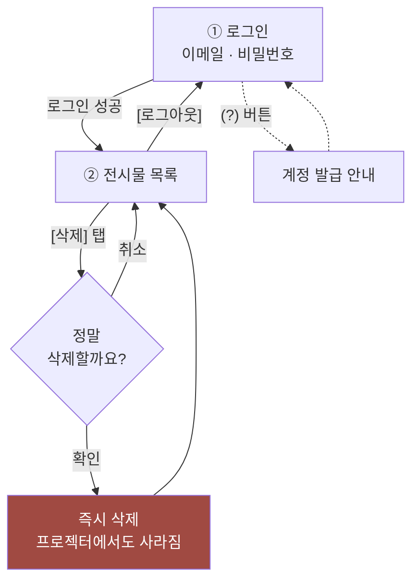

# admin-web — 운영자용 화면

행사 중 **부적절하거나 잘못 올라온 사진을 즉시 내리기 위한** 화면입니다.

이 문서는 개발자가 아니어도 읽을 수 있도록 썼습니다. 행사 당일 이 화면을 맡을 분이
읽고 그대로 따라 할 수 있는 것을 목표로 합니다.

---

## 이 화면이 필요한 이유

참가자가 올린 사진은 **2시간이면 알아서 사라집니다.** 그래서 이 화면의 가치는 딱 하나,
**"지금 당장 내린다"** 입니다.

부적절한 사진이 스크린에 떠 있는데 2시간을 기다릴 수는 없습니다. 전시는 두 시간 반이라
그냥 두면 행사 내내 떠 있게 됩니다. 반대로 말하면, 급하지 않은 것은 굳이 손대지 않아도
행사가 끝나고 알아서 정리됩니다.

---

## 화면 흐름

화면은 **두 개**뿐입니다.



한 번 로그인하면 **새로고침하거나 브라우저를 닫았다 열어도 로그인 상태가 유지됩니다.**
행사 중에 다시 로그인할 일은 없습니다.

---

## ① 로그인 화면

이메일과 비밀번호를 넣고 **[로그인]** 을 누릅니다.

제목 옆의 **(?)** 버튼을 누르면 계정을 어떻게 발급받는지 안내가 뜹니다.
행사 당일 계정을 못 받은 사람이 개발자에게 연락할 수 있도록 연락처도 함께 들어 있습니다.

### 계정 발급 (관리자·개발자용)

**이 앱에는 회원가입 화면이 없습니다.** 계정은 Supabase 대시보드에서 직접 만듭니다.

1. Authentication > Users > **Add user** > Create new user
2. 이메일·비밀번호 입력 후 **"Auto Confirm User"를 켭니다**
   (끄면 메일 인증을 기다리느라 로그인되지 않습니다)
3. Authentication > Sign In / Providers > Email 에서 **가입 허용을 끕니다**

> ⚠️ **3번을 반드시 하세요.** 사진 삭제 권한은 "로그인한 사용자"에게 열려 있습니다.
> 가입이 열려 있으면 누구나 계정을 만들어 전시물을 지울 수 있고,
> 이것은 앱 코드로는 막을 수 없습니다.

---

## ② 전시물 목록 화면

지금 전시 중인 사진이 **최신순 카드 형태**로 보입니다. 각 카드에는 사진, 작성한 메시지,
올라온 시각, 그리고 **[삭제]** 버튼이 있습니다.

> 💡 **빔프로젝터에는 사진만 뜹니다.** 메시지는 화면에 나가지 않지만,
> 판단에 도움이 되도록 이 목록에서는 함께 보여줍니다.

### 목록이 저절로 바뀝니다

이 화면은 **실시간으로 갱신됩니다.**

- 참가자가 새로 올리면 → 맨 앞에 나타납니다
- 2시간이 지나 사라지면 → 목록에서 자동으로 빠집니다

새로고침할 필요가 없습니다. 이미 사라진 사진에 삭제 버튼을 누르는 상황을 막기 위한 설계입니다.

### 삭제하기

**[삭제]** 를 누르면 확인 창이 뜹니다.

> 이 사진을 삭제할까요? 되돌릴 수 없습니다.

확인하면 **즉시** 목록에서 사라지고, **빔프로젝터 화면에서도 곧바로 내려갑니다.**

| 항목 | 내용 |
| --- | --- |
| 되돌리기 | **불가능합니다.** 사진과 글이 완전히 지워집니다 |
| 프로젝터 반영 | 즉시 |
| 참가자 알림 | 없습니다. 참가자는 삭제된 것을 알 수 없습니다 |
| 사진 원본 | 참가자 폰에는 그대로 남습니다 |

> 🗑️ **삭제는 하드 삭제입니다.** "숨김" 같은 중간 상태를 두지 않았습니다.
> 개인 사진을 서버에 남기지 않는 것이 이 프로젝트의 원칙이라, 지우면 실제로 지웁니다.

### 목록이 비어 있다면

> 지금 전시 중인 사진이 없습니다.

정상입니다. 최근 2시간 동안 아무도 올리지 않았다는 뜻입니다.

---

## 행사 당일 체크리스트

- [ ] 행사 전에 계정으로 **로그인이 되는지** 확인 (당일에 비밀번호를 찾는 일이 없도록)
- [ ] 가입 허용이 **꺼져 있는지** 확인
- [ ] 프로젝터가 보이는 자리에 앉기 (화면과 목록을 함께 봐야 판단이 빠릅니다)
- [ ] 급하지 않은 것은 그냥 두기 — 올린 지 2시간이면 알아서 사라집니다

---

## 개발자용 메모

### 실행

```bash
pnpm --filter admin-web dev
```

### 구조

화면이 둘뿐이고 URL로 진입할 이유가 없어 **라우터를 두지 않았습니다.**
로그인 세션의 유무가 곧 화면을 결정합니다 (`src/app/App.tsx`).

| 영역 | 위치 |
| --- | --- |
| 로그인 화면 | `src/pages/login` |
| 목록 화면 | `src/pages/exhibits` |
| 세션 관리 | `src/features/admin-auth` |
| 목록·삭제 | `src/features/manage-exhibits` |
| 도움말 다이얼로그 | `src/shared/ui/HelpDialog` |

### 구현상 유의점

**목록은 Realtime 구독으로 유지합니다.** 참가자가 올리는 사진이 계속 들어오고 2시간이 지난
것은 스스로 사라지므로, 한 번 불러온 목록을 그대로 두면 이미 없는 사진에 삭제를 시도하게 됩니다.

**삭제 후 낙관적으로 목록에서 제거합니다.** Realtime DELETE 이벤트도 곧 도착하지만,
버튼을 누른 즉시 반응이 보이도록 먼저 지웁니다.

**세션이 확인되기 전에는 아무것도 렌더링하지 않습니다.** 저장된 세션을 읽는 사이
로그인 화면이 잠깐 깜빡이는 것을 막기 위해서입니다.

**도움말은 브라우저 기본 `<dialog>`를 씁니다.** `showModal()`이 포커스 가두기,
ESC로 닫기, 바깥 영역 비활성화를 처리해주므로 직접 구현한 것은 backdrop 클릭뿐입니다.

**삭제 권한은 앱이 아니라 DB가 통제합니다.** RLS 정책에서 `authenticated` 롤에만
DELETE를 허용합니다. 자세한 내용은 [supabase/README.md](../../supabase/README.md#rls-요약)를 참고하세요.
