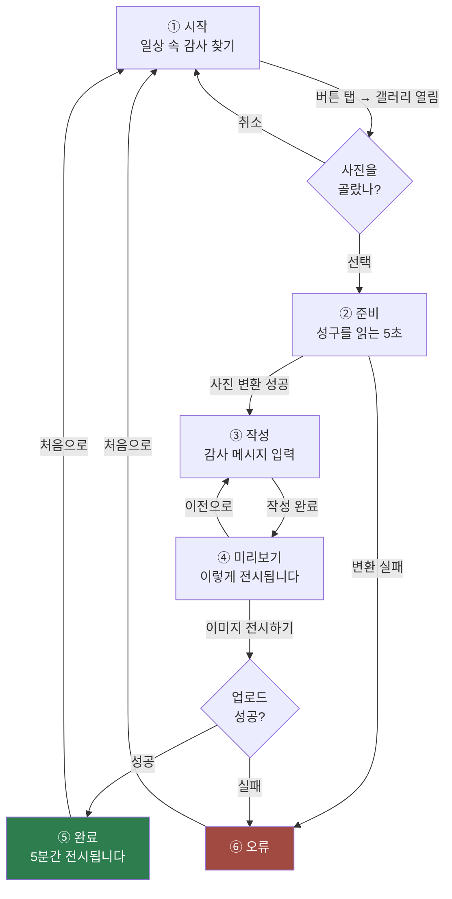

# mobile-web — 참가자용 화면

수련회 참가자가 자기 폰으로 여는 화면입니다. **사진 한 장과 감사의 문장을 올리면 빔프로젝터에 뜹니다.**

이 문서는 개발자가 아니어도 읽을 수 있도록 썼습니다. 화면이 어떤 순서로 흘러가고,
각 화면에서 참가자가 무엇을 보고 무엇을 할 수 있는지 정리한 산출물 문서입니다.

---

## 한눈에 보기

참가자는 **여섯 화면**을 지나갑니다. 정상 흐름은 다섯 단계이고, 문제가 생겼을 때만 오류 화면으로 빠집니다.



---

## 화면별 설명

### ① 시작 화면

> **일상 속 감사 찾기**
> 최근 찍은 사진을 천천히 돌아보며
> 하나님께 감사하게 되는
> 한 장의 사진을 선택해 보세요.

| 참가자가 하는 일 | 결과 |
| --- | --- |
| **[일상 속 감사 찾기]** 버튼 탭 | 폰의 사진 갤러리가 바로 열림 |
| 갤러리에서 사진 선택 | 준비 화면으로 이동 |
| 갤러리에서 취소 | 아무 일도 일어나지 않고 이 화면에 머무름 |

버튼 아래에 **"선택 후 바로 공유되지 않습니다"** 라는 안내가 있습니다.
사진을 고르는 것만으로 전시되지 않는다는 점을 먼저 알려, 부담 없이 고르게 하기 위한 문구입니다.

> 💡 이 화면에 들어올 때마다 이전에 작성하던 내용은 초기화됩니다.

---

### ② 준비 화면

스피너가 돌고, 그 아래 **성구 한 구절**이 표시됩니다. 성구는 여러 개 중 무작위로 하나가 선택됩니다.

**최소 5초 동안 머무릅니다.** 사진을 고른 직후 바로 글을 쓰게 하지 않고,
잠시 성구를 읽으며 마음을 가다듬는 시간을 두기 위한 화면입니다.

이 5초 동안 화면 뒤에서는 **사진을 전시용으로 변환하는 작업**이 실제로 진행됩니다.
폰 카메라 사진은 보통 3~10MB인데 그대로 올리면 150명이 몰릴 때 느려지므로,
빔프로젝터에 필요한 크기(긴 변 1920px, 300KB 이하)로 줄입니다.

| 상황 | 동작 |
| --- | --- |
| 5초 안에 변환이 끝남 | 5초를 채운 뒤 작성 화면으로 |
| 변환이 5초보다 오래 걸림 | 끝날 때까지 기다린 뒤 작성 화면으로 |
| 변환 실패 | 오류 화면으로 |

---

### ③ 작성 화면

> **이 순간 하나님께**
> **어떤 감사를 드릴 수 있었나요?**

고른 사진이 위에 보이고, 그 아래 입력창이 있습니다.

| 항목 | 내용 |
| --- | --- |
| 글자 수 | **최대 100자.** 입력창 오른쪽 아래에 `12 / 100` 형태로 표시 |
| 사진 변경 | **불가능합니다.** 아래 설명 참고 |
| 빈 메시지 | 허용됩니다. 사진만 전시할 수 있습니다 |
| 버튼 | **[작성 완료]** → 미리보기 화면으로 |

> ⚠️ **여기서는 사진을 바꿀 수 없습니다.**
> 준비 화면에서 이미 그 사진을 전시용으로 변환해 두었기 때문입니다.
> 다른 사진으로 바꾸려면 시작 화면으로 돌아가 다시 선택해야 합니다.

이 화면에도 **"내용은 공유되지 않습니다"** 안내가 있습니다. 아직 아무것도 서버에 올라가지 않았습니다.

---

### ④ 미리보기 화면

**빔프로젝터에 실제로 어떻게 보일지**를 그대로 보여줍니다. 사진 아래에 작성한 메시지와 날짜,
그리고 "삶으로 쓰는 예배전 (展)" 문구가 함께 표시됩니다.

| 버튼 | 동작 |
| --- | --- |
| **[이미지 전시하기]** | 실제로 업로드합니다. 이 순간부터 프로젝터에 뜹니다 |
| **[이전으로]** | 작성 화면으로 돌아가 메시지를 고칩니다 |

업로드 중에는 버튼이 **"전시하는 중..."** 으로 바뀌고 두 버튼 모두 눌리지 않습니다.
같은 사진이 두 번 올라가는 것을 막기 위해서입니다.

**이 버튼을 누르기 전까지는 서버에 아무것도 저장되지 않습니다.**

---

### ⑤ 완료 화면

> **이미지 업로드에 성공했어요.**
> 지금부터 5분 동안 화면에 전시된 뒤 사라집니다.

성구가 함께 표시되고, **[처음으로]** 버튼으로 시작 화면에 돌아갑니다.

**"5분 뒤 사라진다"를 반드시 알려야 합니다.** 이걸 모르면 참가자는 자기 사진이 없어진 것을
오류로 받아들입니다. 사라지는 것이 의도된 설계라는 점을 여기서 전달합니다.

---

### ⑥ 오류 화면

무엇이 잘못됐는지 알려주고 **[처음으로]** 버튼을 제공합니다. 성구가 함께 표시됩니다.

| 상황 | 안내 문구 |
| --- | --- |
| 사진 변환 실패 | 사진을 준비할 수 없습니다. 다시 시도해주세요. |
| 업로드 실패 | 사진을 업로드 할 수 없습니다. 다시 시도해주세요. |

---

## 참가자가 알아야 할 규칙

| 규칙 | 내용 |
| --- | --- |
| 전시 시간 | 올린 뒤 **5분**. 이후 자동으로 완전히 삭제됩니다 |
| 사진 | **한 번에 한 장** |
| 글자 수 | 최대 100자 |
| 여러 번 올리기 | 가능합니다. 시작 화면부터 다시 진행하면 됩니다 |
| 올린 뒤 취소 | **불가능합니다.** 운영자에게 요청하면 즉시 내려줍니다 |

---

## 자주 나오는 질문

**Q. 사진을 고르기만 해도 다른 사람이 보게 되나요?**
아니요. **[이미지 전시하기]** 를 누르기 전까지는 폰 안에만 있습니다.

**Q. 제 사진이 사라졌어요.**
정상입니다. 5분이 지나면 자동으로 삭제됩니다. 원본은 폰에 그대로 있습니다.

**Q. 잘못 올렸어요.**
운영자에게 말씀해 주세요. 운영자 화면에서 바로 내릴 수 있습니다.
그러지 않아도 5분 뒤에는 사라집니다.

**Q. 중간에 화면을 나갔다 들어오면요?**
작성하던 내용은 유지되지 않습니다. 처음부터 다시 진행해 주세요.

---

## 개발자용 메모

### 실행

```bash
pnpm --filter mobile-web dev          # 데스크톱 브라우저
pnpm --filter mobile-web dev:host     # 같은 와이파이의 실제 폰
pnpm --filter mobile-web storybook    # 컴포넌트 카탈로그
```

**실제 폰에서 확인하세요.** 갤러리 열기와 터치 영역은 데스크톱에서 재현되지 않습니다.

### 화면과 코드 대응

| 화면 | 경로 | 구현 |
| --- | --- | --- |
| ① 시작 | `/` | `src/pages/home` |
| ② 준비 | `/preparing` | `src/pages/preparing` |
| ③ 작성 | `/compose` | `src/pages/compose` |
| ④ 미리보기 | `/confirm` | `src/pages/confirm` |
| ⑤ 완료 | `/complete` | `src/pages/complete` |
| ⑥ 오류 | `/error?type=...` | `src/pages/error` |

업로드 로직은 `src/features/submit-exhibit`, 작성 중인 데이터는 `src/entities/exhibit`,
이미지 변환은 `src/shared/lib/image`에 있습니다.

### 구현상 유의점

**작성 중인 내용은 라우터 바깥에 보관합니다.** `File` 객체는 URL로 직렬화할 수 없어
search param으로 넘길 수 없습니다. `entities/exhibit`의 Context를 `RootLayout`에 두어
화면을 옮겨도 값이 유지되게 했습니다.

**갤러리는 반드시 버튼의 `onClick`에서 바로 엽니다.** 화면을 먼저 이동한 뒤 코드로 열면
모바일 브라우저가 사용자 제스처 없는 파일 선택으로 보고 차단합니다.

**사진 없이 `/compose`나 `/confirm`에 진입하면 시작 화면으로 되돌립니다.**
새로고침이나 링크 직접 접속이 여기 해당합니다. 그 화면에는 사진을 고를 방법이 없어
그대로 두면 참가자가 갇힙니다.

**입력창은 200ms 디바운스를 겁니다.** 한 글자마다 상태를 갱신하면 글래스 효과를 쓰는
버튼까지 매번 다시 그려집니다. 마지막 입력 후 200ms, 또는 포커스가 빠질 때 반영합니다.

**새로고침 시 404를 막으려면 [`vercel.json`](vercel.json)이 필요합니다.**
클라이언트 라우팅이라 `/compose`에 해당하는 파일이 서버에 없습니다.
